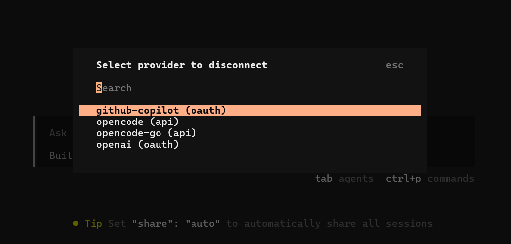
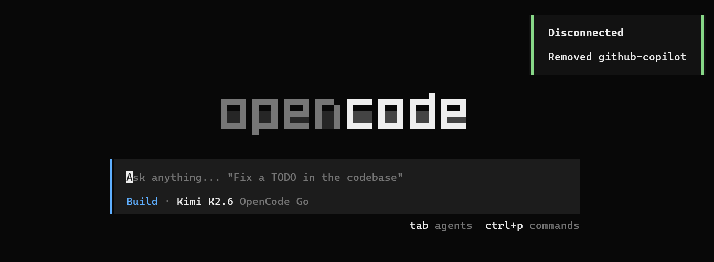

# opencode TUI Utils

[English](./README.md) | [한국어](./README.ko.md) | 日本語 | [中文](./README.zh.md)

<p align="center">
  
</p>

[](https://www.npmjs.com/package/opencode-tui-utils)
[](https://github.com/Blue-B/opencode-tui-utils/actions)
[](LICENSE)

[opencode](https://opencode.ai) のTUIで使う小さなユーティリティ集です。最初のコマンドは、接続済みプロバイダーを安全に解除する `/disconnect` です。

このプロジェクトは、コマンドを1つずつ追加して育てる前提で構成されています。各ユーティリティは、opencode TUI内の明確な問題を1つ解決し、レビューとテストがしやすい形に保ちます。

## プレビュー

<p align="center">
  
</p>

<p align="center">
  
</p>

実際の画面ではopencodeのTUI dialogコンポーネントを使います。外部スクリプトではなく、opencodeのコマンドパレットとdialogの流れの中で動作します。

## なぜ使うのか

| 必要なこと | 得られるもの |
| --- | --- |
| 1つのプロバイダーだけ安全に削除 | TUIで選んだ認証項目だけを削除できます |
| JSONの手動編集を避ける | `~/.local/share/opencode/auth.json`を直接編集する必要がありません |
| トークンを表示しない | プロバイダー名と認証タイプだけを表示し、トークン値は出力しません |
| 小さな機能を追加しやすい | 共通ローダーとAPIラッパーで新しいユーティリティを追加しやすくしています |

## クイックスタート

opencodeのプラグインインストーラーでnpmからインストールします。

```bash
opencode plugin opencode-tui-utils
```

このコマンドはパッケージをインストールし、opencodeの設定を更新します。設定を手動で管理する場合は、`~/.config/opencode/tui.json`に次の項目があることを確認してください。

```json
{
  "$schema": "https://opencode.ai/tui.json",
  "plugin": ["opencode-tui-utils"]
}
```

opencodeを再起動して実行します。

```text
/disconnect
```

## コマンド

| コマンド | エイリアス | 説明 |
| --- | --- | --- |
| `/disconnect` | `/dc` | 接続済みプロバイダーを1つ選び、opencodeの認証ストレージから削除します。新しいセションを開くと変更が反映されます。 |
| `/lsp-toggle` | — | `~/.config/opencode/opencode.json` の `lsp` 設定を true/false に切り替えます。opencodeの再起動が必要です。 |

## `/disconnect` の動作

`/disconnect` はopencodeの認証ファイルを読み、トップレベルのプロバイダーキーを一覧表示し、選択したプロバイダーだけを削除して同じファイルへ保存します。

例:

```json
{
  "github": { "type": "copilot-free" },
  "anthropic": { "type": "api-key" },
  "openai": { "type": "api-key" }
}
```

`github`を選択した場合、トップレベルの`github`キーだけが削除されます。`anthropic`や`openai`など他のプロバイダーは残ります。

> **注意:** opencodeはセション開始時に認証ファイルを読み込みます。切断後は新しいopencodeウィンドウまたはセションを開くと、更新されたプロバイダー一覧が反映されます。

出発点は [opencode issue #10494](https://github.com/anomalyco/opencode/issues/10494) で話されていたプロバイダー解除の不便さでした。

## データ保存

| データ | 場所 | 説明 |
| --- | --- | --- |
| プロバイダー認証 | `~/.local/share/opencode/auth.json` | 選択したプロバイダーキーだけを削除します |
| カスタム認証パス | `OPENCODE_AUTH_PATH=/path/to/auth.json` | 標準以外の場所を使う場合の上書きです |
| プラグインソース | npm package / opencode plugin cache | `/disconnect`は外部サービスへリクエストしません |

`/disconnect`はネットワークリクエストを送らず、トークン値をコピーしたりUIに出力したりしません。

## ユーティリティの追加

新しいコマンドは `src/plugins/` 配下に個別のプラグインモジュールとして追加し、`src/index.tsx`から登録します。

```text
src/
  core/
    api-wrapper.ts      opencode TUI APIの共通ラッパー
  plugins/
    disconnect.tsx      プロバイダー解除コマンド
    lsp-toggle.tsx      LSP切り替えコマンド
    your-command.tsx    新しいユーティリティの追加先
  index.tsx             公開プラグインエントリ
```

opencode TUI APIを使う場合は `createWrappedAPI(rawApi)` を通してください。opencodeのプラグインAPIが変わった場合の修正箇所を減らすためです。

## 開発

```bash
git clone https://github.com/Blue-B/opencode-tui-utils.git
cd opencode-tui-utils
npm install
npm run build
```

## 互換性

テスト済みの環境です。

| ツール | バージョン |
| --- | --- |
| opencode | 1.14.46 |

このパッケージはopencodeのTUI Plugin APIを使うため、peer dependencyとして`@opencode-ai/plugin >=1.14.42`を指定しています。

## コントリビューション

IssueとPRを歓迎します。新しいコマンドを追加する前に[CONTRIBUTING.md](CONTRIBUTING.md)を確認してください。小さく、目的がはっきりした変更を歓迎します。

## ライセンス

MIT
