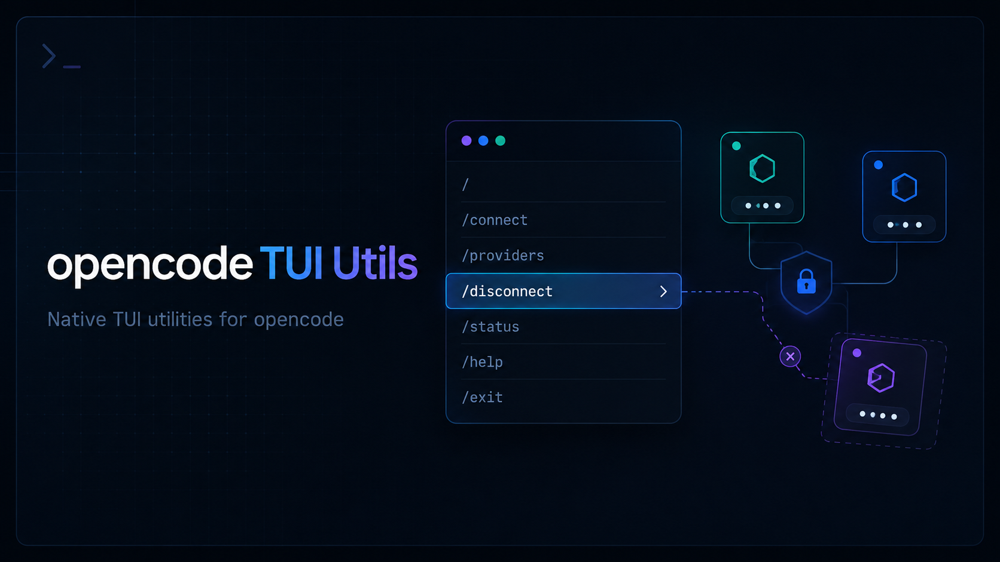

# opencode TUI Utils

[English](./README.md) | [한국어](./README.ko.md) | [日本語](./README.ja.md) | 中文

<p align="center">
  
</p>

[](https://www.npmjs.com/package/opencode-tui-utils)
[](https://github.com/Blue-B/opencode-tui-utils/actions)
[](LICENSE)

面向 [opencode](https://opencode.ai) TUI 的小型工具集。第一个命令是 `/disconnect`，用于安全地断开一个已连接的 provider，不需要手动编辑 `auth.json`。

这个项目按“一个命令解决一个问题”的方式扩展。每个工具都应该聚焦于一个 opencode TUI 场景，并保持容易审查、测试和移除。

## 预览

```text
> /disconnect

Select provider to disconnect

  github       copilot-free
> anthropic   claude-pro
  openai      api-key

Enter disconnects the selected provider.
```

实际界面使用 opencode 的 TUI dialog 组件，所以它在 opencode 的命令面板和 dialog 流程中运行，而不是额外启动脚本。

## 为什么使用它

| 需求 | 提供的能力 |
| --- | --- |
| 安全移除一个 provider | 在 TUI 中选择并只删除对应认证项 |
| 避免手动编辑 JSON | 不需要直接打开 `~/.local/share/opencode/auth.json` |
| 避免 token 暴露 | 只显示 provider 名称和认证类型，不输出 token 值 |
| 方便继续扩展 | 共享插件加载器和 API wrapper 让新增工具更简单 |

## 快速开始

使用 opencode 的插件安装器从 npm 安装：

```bash
opencode plugin opencode-tui-utils
```

这个命令会安装包并更新 opencode 配置。如果你手动管理配置，请确保 `~/.config/opencode/tui.json` 包含：

```json
{
  "$schema": "https://opencode.ai/tui.json",
  "plugin": ["opencode-tui-utils"]
}
```

重启 opencode，然后运行：

```text
/disconnect
```

## 命令

| 命令 | 别名 | 说明 |
| --- | --- | --- |
| `/disconnect` | `/dc` | 选择一个已连接的 provider，并从 opencode 的认证存储中移除。 |
| `/lsp-toggle` | — | 切换 `~/.config/opencode/opencode.json` 中的 `lsp` 设置。需要重启 opencode。 |

## `/disconnect` 如何工作

`/disconnect` 会读取 opencode 的认证文件，列出顶层 provider key，然后只删除你选择的那一个 provider，并把结果写回同一个文件。

示例：

```json
{
  "github": { "type": "copilot-free" },
  "anthropic": { "type": "api-key" },
  "openai": { "type": "api-key" }
}
```

如果选择 `github`，只会删除顶层的 `github` key。`anthropic`、`openai` 等其他 provider 会保持不变。

它最初来自 [opencode issue #10494](https://github.com/anomalyco/opencode/issues/10494) 中提到的 provider 断开问题。

## 数据存储

| 数据 | 位置 | 说明 |
| --- | --- | --- |
| Provider 认证 | `~/.local/share/opencode/auth.json` | 只从这里删除选择的 provider key |
| 自定义认证路径 | `OPENCODE_AUTH_PATH=/path/to/auth.json` | 用于非默认数据目录 |
| 插件源码 | npm package / opencode plugin cache | `/disconnect` 不会访问外部服务 |

`/disconnect` 不会发送网络请求，不会复制 token 值，也不会把 token 值显示在 UI 中。

## 添加更多工具

新命令作为单独的插件模块放在 `src/plugins/` 下，并从 `src/index.tsx` 注册。

```text
src/
  core/
    api-wrapper.ts      opencode TUI API 的共享 wrapper
  plugins/
    disconnect.tsx      Provider 断开命令
    lsp-toggle.tsx      LSP 切换命令
    your-command.tsx    新工具放在这里
  index.tsx             公开插件入口
```

使用 opencode TUI API 时请通过 `createWrappedAPI(rawApi)`。这样当 opencode 插件 API 变化时，更新位置会更集中。

## 开发

```bash
git clone https://github.com/Blue-B/opencode-tui-utils.git
cd opencode-tui-utils
npm install
npm run build
```

## 兼容性

已测试环境：

| 工具 | 版本 |
| --- | --- |
| opencode | 1.14.46 |

这个包使用 opencode 的 TUI Plugin API，因此将 `@opencode-ai/plugin >=1.14.42` 声明为 peer dependency。

## 贡献

欢迎 issue 和 PR。添加新命令前请先阅读 [CONTRIBUTING.md](CONTRIBUTING.md)。更推荐小而清晰的改动。

## 许可证

MIT
